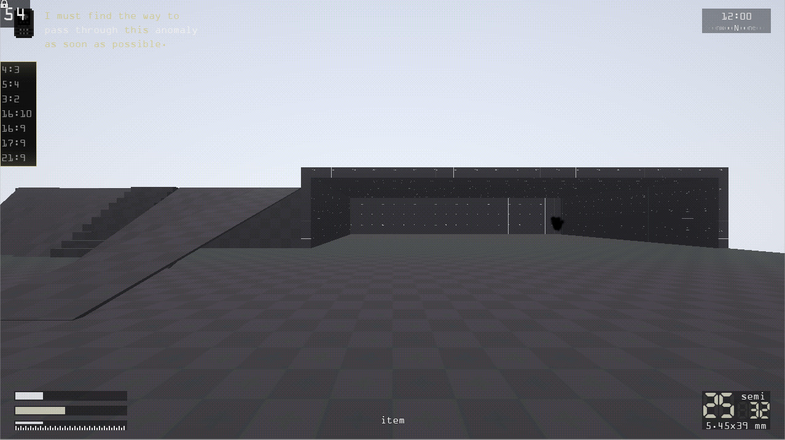

# Anomaly Zero

This work is licensed under a <a rel="license" href="http://creativecommons.org/licenses/by-nc-nd/4.0/">Creative Commons Attribution-NonCommercial-NoDerivatives 4.0 International License (CC-BY-NC-ND)</a>.
________________

**Engine - Godot 3**

**Language - C#**

**Source Code - Lost**

**Executables - Lost**

**Development Date - 2021**

________________

## Description
A small mockup of a S.T.A.L.K.E.R.-like game, was an attempt to get more clean slate to make a game but didn't survive due to Godot 3 C# negatives.

Original source code is lost. Source code in this repository is what's left of Anomaly Zero and was "recovered" from a project to test Godot 4 features.

## Screenshots
Initial version

 

Later version

 

## Videos
[Anomaly](https://youtu.be/HNW7Taa5Cas)

[Movement](https://youtu.be/oQWnoJMPq8k)

[Weapon](https://youtu.be/T7U-0_Tq2x8)

[Day-Night Cycle](https://youtu.be/6XD1aj1EhHI)
